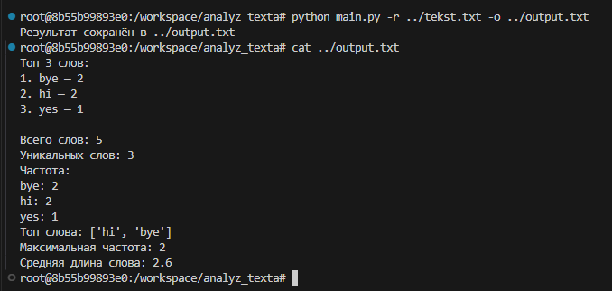

Простой CLI-инструмент для анализа текста:
подсчёт слов
частота
топ-N слов
средняя длина слова

Возможности:
📂 Чтение текста из файла (-r)
⌨️ Ввод текста вручную
📊 Топ-N слов (-n)
💾 Сохранение результата в файл (-o)
🧹 Очистка текста (знаки препинания, регистр)

## 🔧 Пример запуска

```bash
python main.py -r text.txt -n 3 -o output.txt


## 📸 Пример работы

